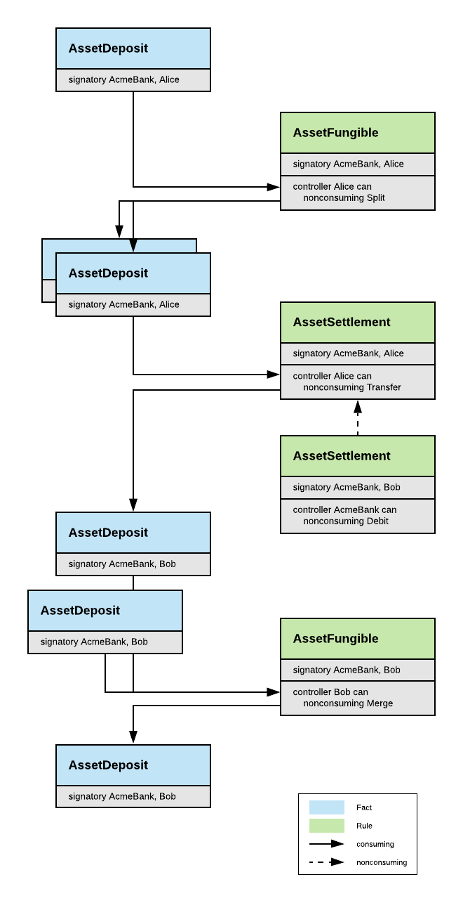
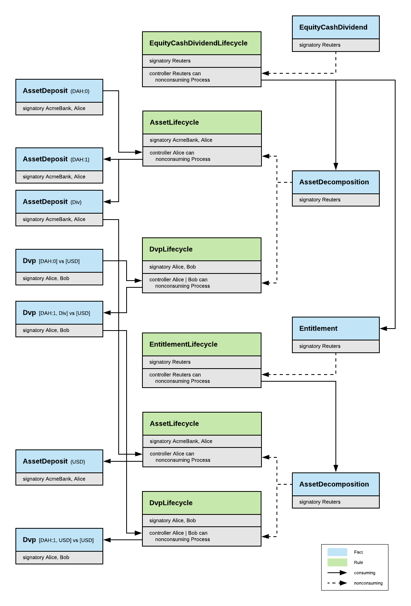

# DAML Finance Library (FinLib)

[](https://circleci.com/gh/digital-asset/lib-finance)

    Copyright (c) 2019, Digital Asset (Switzerland) GmbH and/or its affiliates. All rights reserved.
    SPDX-License-Identifier: Apache-2.0

## Introduction

The FinLib is a collection of DAML templates and pure functions that can
be used as building blocks to speed up application development and to
increase code reuse, standardisation and compatibility across solutions.

Currently, it contains DAML models for:

1. [Assets](#assets)
2. [Delivery vs Payment (DvP) Trades](#delivery-vs-payment-(dvp)-trades)
3. [Corporate Actions](#corporate-actions)
4. [Calendar Functions](#calendar-functions)

Additional functionality will be added over time based on user feedback
and demand. Thanks to its modular design, it's straightforward to use
all the workflows of the FinLib or to selectively replace certain steps
depending on the requirements of the solution.

This Readme provides a conceptual overview of the FinLib. The individual
contracts, fields and choices are described in the more detailed
[reference documentation](docs/Reference.md).

## Prerequisites

* [DAML SDK](https://daml.com/) to work with the DAML code

## Getting Started

Digital Asset is working on adding a DAML package management system to
the DAML SDK. This will allow to reference the FinLib package from a
a project and to import FinLib modules as usual, for example:

```
import DA.Finance.Fact.Asset
```

In the meantime, a pragmatic way to use the FinLib is to copy its
source code into a project.

## Facts and Rules Pattern

Similar to a [business rules engine](https://en.wikipedia.org/wiki/Business_rules_engine)
the FinLib achieves a modular design by splitting DAML templates into `Fact`
and `Rule` contracts. `Fact` contracts hold data but have no choice except
for the built-in `Archive` and `Rule` contracts manipulate data through
`nonconsuming` choices that take `n Facts` as inputs, archive them and
create `m Facts` as output. `Rule` contracts typically get created when
setting up a market or a trade relationship as they define the way how
the two parties will subsequently transact. Concrete examples are the
rules that govern an account or a master agreement. A big advantage
of this pattern is that `Rule` contracts can be combined freely. For
example, a solution might use the `AssetSettlement` rule of the FinLib
but a different `AssetFungible` rule. Or it might add its own `AssetLock`
rule that can also act on `AssetDeposit` facts. Last but not least, it's
possible to add new rules to a running solution on the fly, for example
to enact a court ruling requiring a state change that wasn't foreseen
originally.

## Contract Ids and Trust Models

The FinLib addresses data with the following versioned identifier that is
backed by a set of signatories:

```
data Id = Id
  with
    signatories : Set Party
    label : Text
    version : Int
  deriving (Eq, Show)
```

The `signatories` are the parties that need to sign a contract with this id
and that are responsible to ensure uniqueness of the `label`. The `version`
allows to model multiple revisions of the same contract.

Using a set of `signatories` allows the FinLib to support various trust models.
For example, an `AssetDeposit` might be signed by (i) both the provider and
the owner, (ii) just the provider or (iii) a third party agent. All approaches
are valid depending on the desired level of trust between participants or the
required flexibility to force upgrades.

## Assets

The `AssetDeposit` fact represents a deposit of a generic asset in an account.
The `account.id` and `asset.id` fields can be used to link the contract to other
contracts that provide further information such as the type of the asset or
reference data for it. This allows new asset classes to be added without having
to modify business processes that operate on generic asset deposits. A deposit
is allocated to an account and backed by the `account.id.signatories`. The
deposited asset is specified by the `asset.id`. The `asset.id.signatories` are
the parties that publish reference data for the asset and hence define what
it is and how it can be lifecycled.

The `AssetFungible` rule specifies how asset deposits can be split and merged and
the `AssetSettlement` rule defines the logic to credit or debit an asset in an
account or to transfer it into another account with a new owner.



## Delivery vs Payment (DvP) Trades

The `Dvp` fact represents an obligation to exchange the payment assets against
the delivery assets at the agreed settlement date. A trade is allocated to an
master agreement and backed by the masterAgreement.id.signatories.
Depending on the desired trust model this might be both counterparties or a
third party agent.

The `DvpSettlement` rule allows to settle a Dvp by providing fully allocated
settlement chains for each payment and delivery obligation. An `AssetSettlementChain`
is a helper contract that allows to allocate assets and to atomically settle
a chain of transfer instructions up and down an account hierarchy. If the two
counterparties have an account with the same provider, the chain simplifies to
a single transfer instruction.


## Corporate Actions

The `AssetLifecycle` and `DvpLifecycle` rules allow to apply corporate actions
to `AssetDeposit` and `Dvp` facts. Typically, lifecycling an asset increases
its version number and optionally creates other assets such as a dividend
payment. The details of a corporate action are captured in a reference data
contract with the same version number as the asset to which it applies, for
example an `EquityCashDividend` fact. In order to avoid dealing with any type
of corporate action in the asset and trade lifecycle rules, the reference data
provider can use a specific reference data contract to create a generic
`AssetDecomposition` fact that allows to describe any corporate action that
replaces one asset by `n` other assets.



## Calendar Functions

[DA.Finance.Base](daml/DA/Finance/Base) includes a set of pure functions to deal
with dates, holiday calendars, and schedules. See the [reference documentation](docs/Reference.md)
for all available functions.
