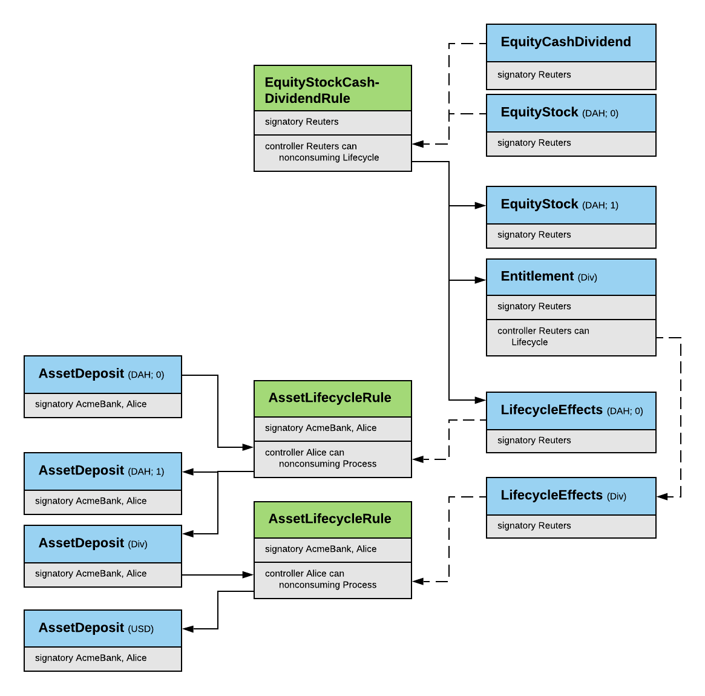

# DAML Finance Library (FinLib)

[](https://circleci.com/gh/digital-asset/lib-finance)

    Copyright (c) 2019, Digital Asset (Switzerland) GmbH and/or its affiliates. All rights reserved.
    SPDX-License-Identifier: Apache-2.0

## :mega: Deprecation notice :mega:

This library has been superseded by an updated Daml Finance library.

You can read more about it on [Digital Asset's website](https://www.digitalasset.com/daml-finance) or jump straight into [the code](https://github.com/digital-asset/daml-finance).

The new library is built on Daml interfaces, which improves composability and facilitates contract upgrades. Moreover, it offers additional features such as a powerful instrument modeling framework.

## Introduction

The FinLib is a collection of pure functions, DAML templates and triggers
that can be used as building blocks to speed up application development and
to increase code reuse, standardisation and compatibility across solutions.

Currently, it contains code for:

1. [Assets](#assets)
2. [Asset Transfers](#asset-transfers)
3. [Delivery vs Payment (DvP) Trades](#delivery-vs-payment-(dvp)-trades)
4. [Corporate Actions](#corporate-actions)
5. [Calendar Functions](#calendar-functions)

Additional functionality will be added over time based on user feedback
and demand. Thanks to its modular design, it's straightforward to use
all the workflows of the FinLib or to selectively replace certain steps
depending on the requirements of the solution.

This Readme provides a conceptual overview of the FinLib. The individual
contracts, fields and choices are described in the more detailed
[model reference documentation](docs/Reference_Model.md). Corresponding triggers are
described in the [trigger reference documentation](docs/Reference_Trigger.md).

## Prerequisites

* [DAML SDK](https://daml.com/) to work with the DAML code

## Getting Started

Digital Asset is working on adding a DAML package management system to
the DAML SDK. This will allow to reference the FinLib package from a
a project and to import FinLib modules as usual, for example:

```
import DA.Finance.Fact.Asset
```

In the meantime, a pragmatic way to use the FinLib is to copy its
source code into a project.

## Contract Ids and Trust Models

The FinLib addresses data with the following versioned identifier that is
backed by a set of signatories:

```
data Id = Id
  with
    signatories : Set Party
    label : Text
    version : Int
  deriving (Eq, Show)
```

The `signatories` are the parties that need to sign a contract with this id
and that are responsible to ensure uniqueness of the `label`. The `version`
allows to model multiple revisions of the same contract.

Using a set of `signatories` allows the FinLib to support various trust models.
For example, an `AssetDeposit` might be signed by (i) both the provider and
the owner, (ii) just the provider or (iii) a third party agent. All approaches
are valid depending on the desired level of trust between participants or the
required flexibility to force upgrades.

## Assets

The `AssetDeposit` represents a deposit of a generic, fungible asset in an account.
The `account.id` and `asset.id` fields can be used to link the contract to other contracts
that provide further information such as the type of the asset or reference data for it.
This allows new asset classes to be added without having to modify business processes that
operate on generic asset deposits.

A deposit is allocated to an account and backed by the `account.id.signatories`. The
deposited asset is specified by the `asset.id`. The `asset.id.signatories` are
the parties that publish reference data for the asset and hence define what
it is and how it can be lifecycled.

The AssetDeposit is `fungible` by design as it includes the choices how to `Split` a single
deposit into multiple and `Merge` multiple deposits into a single one.

Note that the library does not model positions. Positions can be derived e.g. client
side by aggregating all asset deposits or a trigger that periodically updates a position
contract by looking at all asset deposits.

## Asset Transfers

The `AssetSettlement` template allows to transfer `AssetDeposit`s from one account
to another by consuming a deposit and then crediting the asset to the receiver\`s
account. This requires that the sender is allowed to `Credit` in the receiver's
account through his `AssetSettlement` contract.


## Delivery vs Payment (DvP) Trades

The `Dvp` is a trade that represents an obligation to exchange the payment assets
against the delivery assets at the agreed settlement date. A trade is allocated to
a master agreement and backed by `masterAgreement.id.signatories`. Depending on the
desired trust model this might be both counterparties or a third party agent.

Trades in general need to be settled. As part of instructing a trade a set of
`SettlementInstruction`s should be created. The library does not include the logic
of how a DvP gets instructed because the process is often very bespoke to the
given use case.

Parties need to allocate deposits to `SettlementInstruction`s. In
the easy case where both counterparties have an account with the same provider a
direct transfer from the sender to the receiver is possible, i.e. a single step
need to be specified. The `SettlementInstruction` can also handle more complex use
cases where assets are *atomically* transferred up and down an account hierarchy.
In these cases multiple steps corresponding to the hierarchy are required.

The trigger package includes an `AllocationRule` template that helps to allocate
deposits to settlement instructions and a trigger that eagerly allocates deposits.

The `DvpSettlement` template allows to settle a DvP by providing fully allocated
settlement instructions for each payment and delivery obligation.

The trigger package again includes a trigger that settles fully allocated DvPs.


## Corporate Actions

Similar like there is a generic asset deposit that can hold any asset, there
is a generic `LifecycleEffects` template storing the details of an asset's lifecycle
event by defining the outcome, i.e the `effects`. This avoids dealing with any type
of corporate action in the `AssetLifecycle` and `DvpLifecycle` rules. Those rules are
used to lifecycle `AssetDeposit`s and `DvP`s based on `LifecycleEffects` contracts only.
Triggers are available to automate the process.

Details of corporate actions are captured in reference data contracts with the same
version number as the asset to which it applies, for example an `EquityCashDividend`.
The reference data provider can use such a specific reference data contract to create
the generic `LifecycleEffects` contract.



## Calendar Functions

[DA.Finance.Base](daml/DA/Finance/Base) includes a set of pure functions to deal
with dates, holiday calendars, and schedules. See the [reference documentation](docs/Reference.md)
for all available functions.
